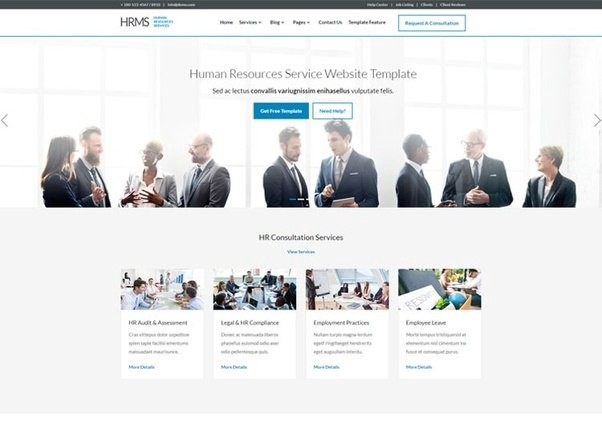
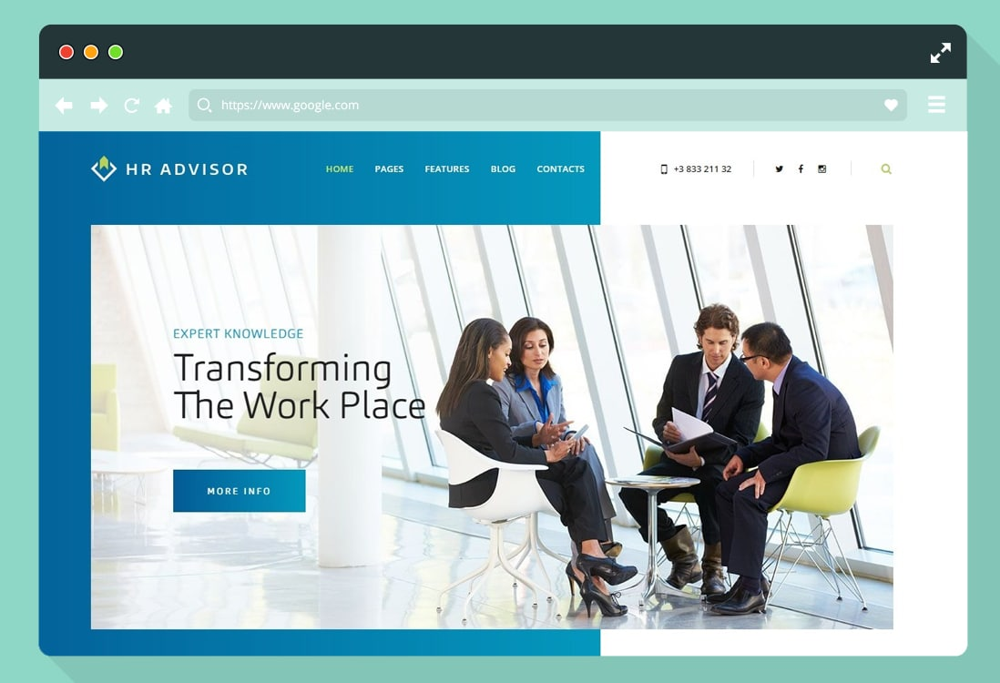

# Funkcionális specifikáció

### 1. Áttekintés
A projekt célja egy olyan portál létrehozása, amely megkönnyíti az álláskeresést mind a fejvadászok, és az álláskeresők számára. Egy regisztrációval és önéletrajzzal már készen is vagyunk, nincs más teendőnk. Minden platformon használható.

### 2. Jelenlegi helyzet
A COVID vírusra való tekintettel az emberek többnyire otthon töltik az idejüket. Sokan elvesztették munkájukat, így sok az álláskereső. A repetitív, unalmas otthon üléssel sokan ki akarnak törni régi állásukból, és miközben otthon dolgoznak, nézelődnek más irányba.

### 3. Használati esetek
Két felhasználói szerepkör tartozik az alkalmazáshoz: user és admin. Az adminok kezelik, hogy kik csatlakozhatnak ehhez a kis, családias közösséghez. Belépés engedélyezése után a userek képesek adatokat felvinni, és módosítani az oldalon.

### 4. Vágyálomrendszer
A készítendő projekt célja egy olyan, kis méretűként induló, később korlátlanul naggyá váló portál létrehozása, mely a legkülönfélébb témakörökben nyújt egy helyen megtalálható aloldalakat.

### 5. Jelenlegi rendszer leírása
Célunk egy olyan alkalmazás létrehozása, ahol a HR-eseknek minden a kezük alatt van, és egyszerűen tudnak kezelni adatokat.

### 6. Vágyálomrendszer
A projekt célja egy továbbgondolt álláskereső portál, ahol egyszerűen és gyorsan kontaktálhatunk a jelentkezőkkel.

### 7. Rendszerre vonatkozó szabályok
Az alkalmazást a helyzethez viszonyodva otthonról kell megvalósítanunk, egymással folyamatosan kommunikálva a SCRUM segítségével, úgy, hogy a követelménylistát és az egyéb pontokat hiánytalanul figyelembe vesszük.

### 8. Képernyőtervek 

### 9. Forgatókönyvek
Az oldal egyszerű, letisztult hogy mindenki számára használható legyen. Hiszen állást nem csak a fiatalok keresnek, hanem az idősebb generáció is, akiknek gondot okozhat egy bonyolult oldal kezelése.
