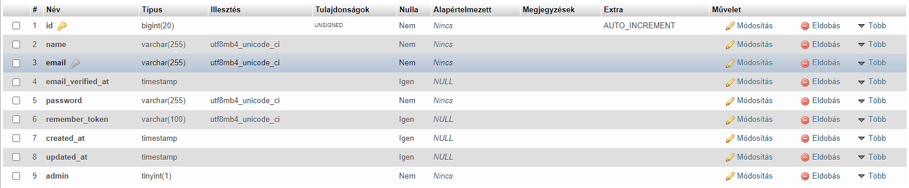

# Rendszerterv

### 1. A rendszer célja
A rendszer célja egy autókatalógus létrehozása, amelyhez bárhol bárki bármikor hozzáférhet. Az alkalmazás kinézete egyszerű, letisztult. Ebből kifolyólag könnyen kezelehető lesz. Jelenleg csak Windows platformra készül, a jövőben sincs tervben telefonos változat(ok) kiadása. 

### 2. Projektterv
Rendelkezésre álló szoftvererőforrások:
•	Windows 10 operációs rendszer
•	Visual Studio 2019
•	Visual Code
•	MongoDb Compass
•	Postman
•	Node Js localhost szerver
Rendelkezésre álló hardvererőforrások:
•	Fejenként legalább egy IBM PC 8 vagy 16 GB RAM-mal, 1 TB SSD vagy HDD tárhellyel, i5-ös vagy i7-es processzorral
Rendelkezésre álló idő, ütemterv:
•	Rendszerterv: 1. hét
•	Funkcionális és követelményspecifikáció: 2. hét
•	Alapprojekt kialakítása és szükséges anyagok  összegyűjtése, adatbázisok létrehozása: 3. hét
•	Főbb funkciók és autentikáció kidolgozása: 4. hét
•	Stílus, megfelelő struktúra kialakítása: 5. hét
•	Tesztelés: 6. hét
Projekt szerepkörök, felelősségek:
•	Az adatbázis struktúrájáért felel: Ravasz Bálint
•	A user interface kialakítása, menühierarchia, navigáció: Ravasz Bálint
•	Backend: Ravasz Bálint
•	Kapcsolattartás: Ravasz Bálint
 
 ### 3. Üzleti folyamatok modellje
 A célunk egy olyan alkalmazás létrehozása, amelyet az átlag felhasználók könnyen tudnak a mindennapokban használni.
Üzleti szereplők:
-Szolgáltatást nyújtó cégek, akik megjelennek az oldalon -Látogatók -Adminok
Üzleti folyamatok:
•	A látogatók elérhetik az összes funkciót, minden információt a belépés után
•	Biztonsági okokból új felhasználó csak kérvényezés után kerülhet a rendszerbe, ezzel kiszűrve a csalókat
•	Az adminok kezelik a felhasználókat

### 4. Követelménylista
A szerver NodeJs nyelven írodik, míg a kliens C#-ban, azon belül pedig Winforms technológiában.

### 5. Funkcionális terv
Rendszerszereplők: Adminok, látogatók. Mivel az alkalmazás egy gyűjtő portal, ezért nincs szükség további felhasználóra. 
Rendszerhasználati eset: Az adminok akik belépési jogot adnak, és a felhasználók akik belépés után publikálni tudnak. (belépés nélkül csak olvasni)
Menühiearchia: Belépés előtt kizárólag csak olvasni lehet, minden egyéb funkció elérhetetlen.

### 6. Adatbázis terv
User: Nevet, és hozzátartozó jelszót és emailt tartalmaz.
Mindenről készül timestamp, hogy mikor regisztrált, és updatelt adatokat. 
Minden felhasználóhoz generálunk egy automatikus id-t amely egy szám lesz.

### 7. Tesztterv 
A tesztelések célja a rendszer és összetevői működőképességének vizsgálata, és leellenőrzése. TESZTELÉSI ELJÁRÁSOK: Unit teszt: Már a kódolási szakasz alatt a szintaktikai/szemantikai hibák kiaknázása, a kód metódusai akkor vannak kész, ha az ezekre készített Unit tesztekre hibamentesen lefutnak. Alfa teszt: A kész projekt tesztelése minden elérhető felületen, platformon, azok verziószámain, hibákat keresve, szélsőséges eseteket szimulálva, az esetleges hibák megtalálása érdekében. A tesztet a fejlesztők végzik, ideálisan mindenki a saját beosztott projektrészének megfelelően. Beta teszt: A weboldal kiadása után publikált állapotában már nem a fejlesztők végzik, a kiadott platformok összes verzióján hibamentesen kell működnie a terméknek ennek a tesztelési fázis befejeztével. A tesztelők visszajelzéseket küldhetnek a fejlesztőknek, ezzel kisegítve őket. Minden backend szolgáltatásnak, bejelentkezési, rendelési, értékelési felületnek hibamentesen kell működnie minden platformon. Esetleges hibák során a felhasználót lekezelt kivételekkel kell tájékoztatni.